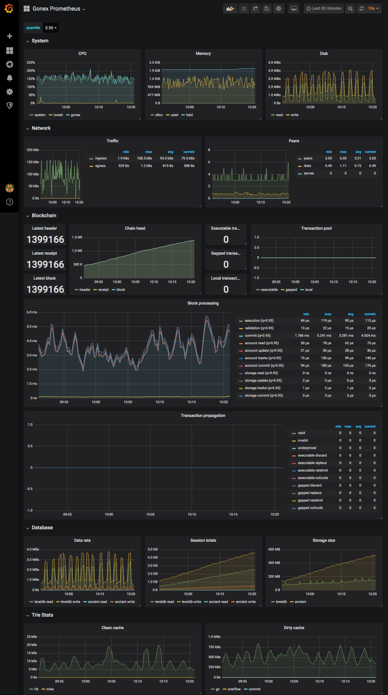

# Gonex prometheus metrics

Collect and visualize [Gonex](https://github.com/nextyio/gonex) metrics with Prometheus and Grafana.

## Demo

```bash
> docker-compose up -d
```

Runs Gonex on the testnet, Prometheus for data storage and Grafana for visualizing.

Open [localhost:3000](http://localhost:3000) (admin:admin) to explore the Grafana metrics dashboard.

## Dashboard


